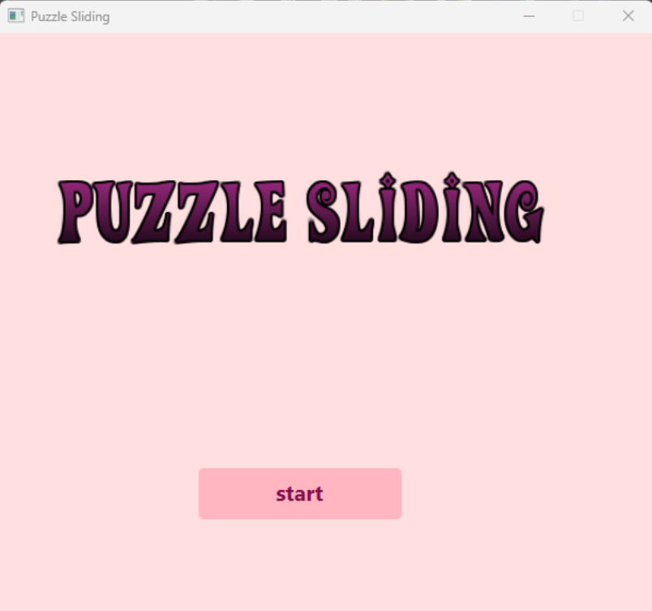
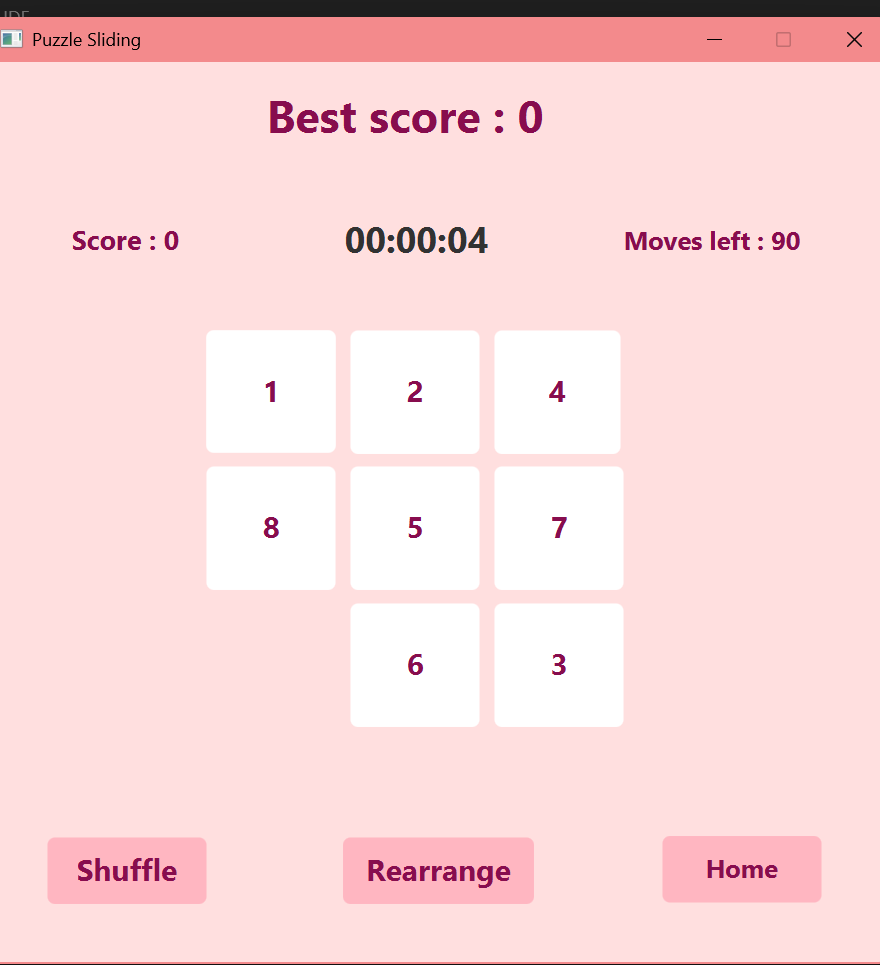
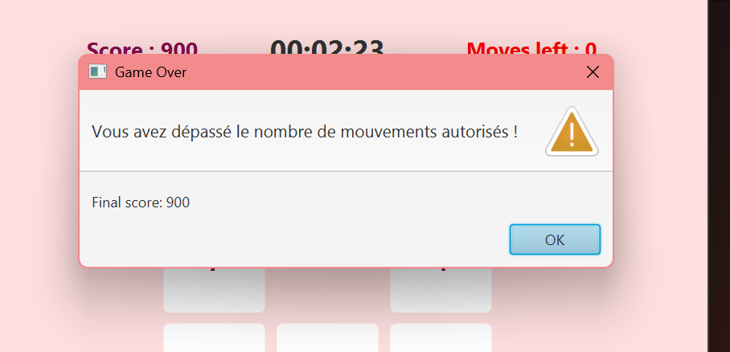

# 🧩 PuzzleGame

A sliding puzzle (8-puzzle) game built with Java / JavaFX — 3x3 grid, scoring, timer and win detection.

## Features

- 3x3 grid with click-to-move tiles (adjacent to the empty slot)
- Automatic win detection
- Scoring system (+10 per move) with best score tracking
- 90-move limit, with color-coded warnings as moves run low
- Real-time timer (hh:mm:ss)
- Random grid shuffle (6 predefined configurations)
- Quick reset to a fixed configuration
- Navigation between home screen and game screen

## Preview

| Home | Game | Lose |
|---|---|---|
|  |  |  |

## Tech Stack

- **Java**
- **JavaFX** — UI (FXML) and styling (CSS)

## Project Structure

```
PuzzleGame/
├── Main.java              # Entry point
├── StartController.java   # Home screen logic
├── GameController.java    # Game logic (movement, score, timer, win detection)
├── start.fxml              # View: home screen
├── grid.fxml                # View: game grid
├── application.css         # Styles
└── puzzle (2).png          # Menu visual
```

## Installation

**Requirements**: JDK 17+, [JavaFX SDK](https://gluonhq.com/products/javafx/)

```bash
git clone https://github.com/BkNaila/PuzzleGame.git
```

1. Place the `.java`, `.fxml`, `.css` files inside `src/application` (package `application`)
2. Add the JavaFX SDK `.jar` files to the build path
3. Run `Main.java` with the following VM arguments:
```
--module-path "/path/to/javafx-sdk/lib" --add-modules javafx.controls,javafx.fxml
```

## Author

**Naila** — [@BkNaila](https://github.com/BkNaila)
